### Boring OI’ Hello World

src/hello-world/main.go

```go
package main

import "fmt"

func main() {
	fmt.Println("Hi there!")
}
```

### Five Important Questions

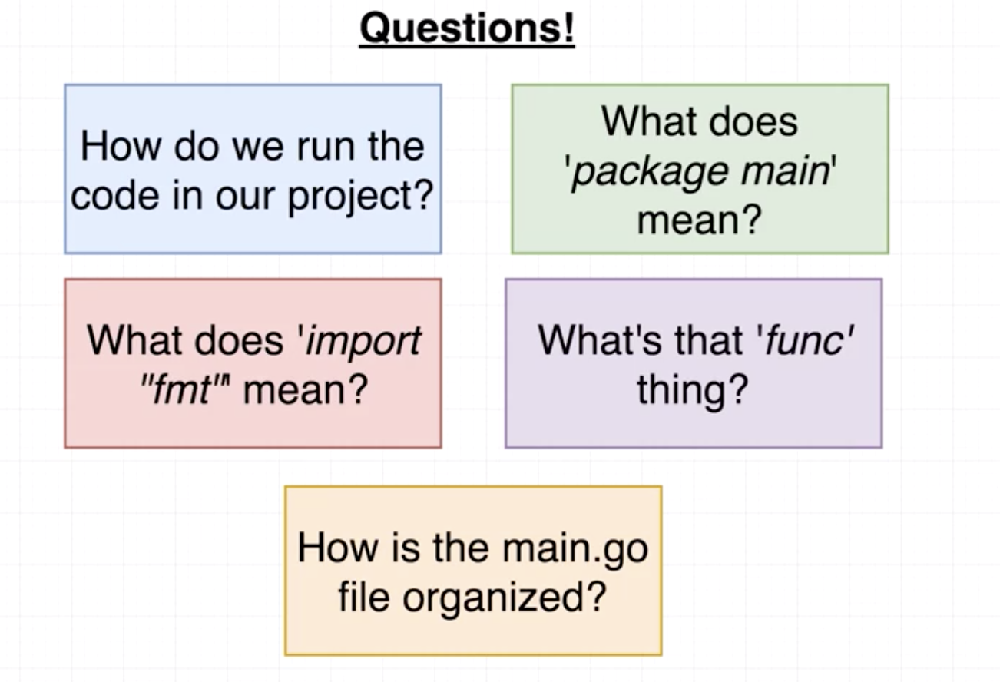

**How do we run the code in our project?**

```sh
go run main.go
```

How do we run the code in our project?

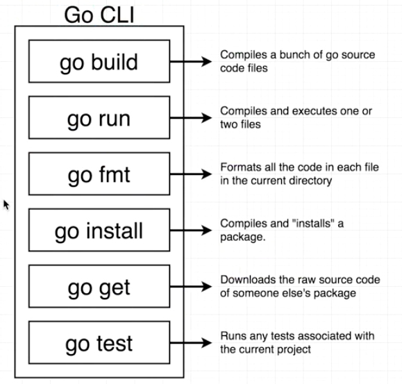

### Go Packages

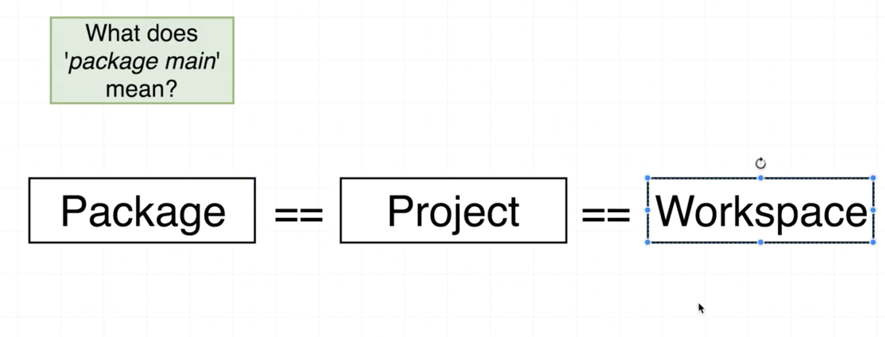

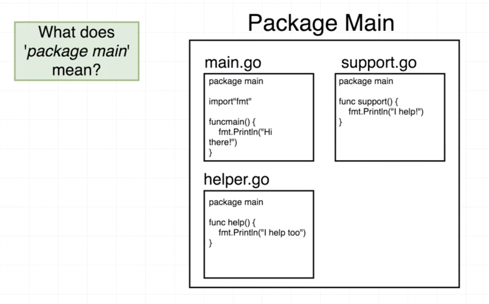

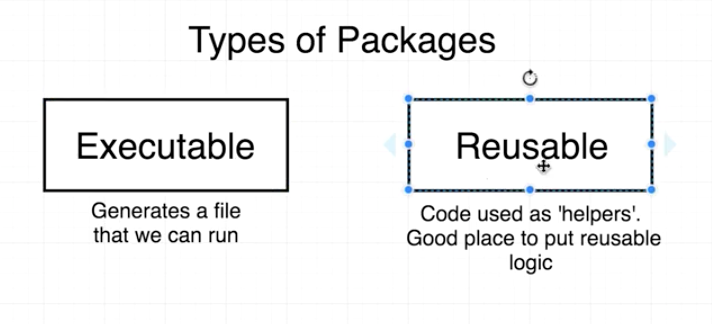

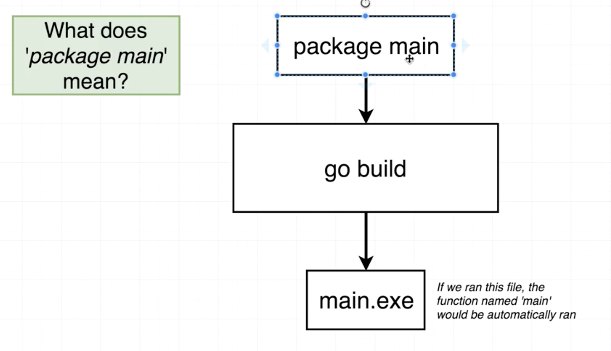

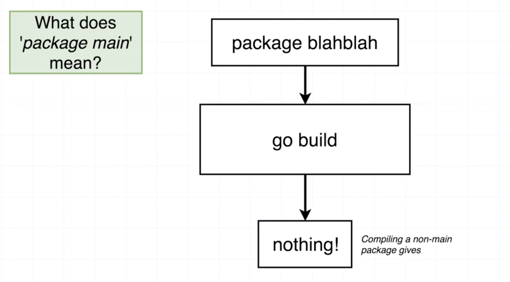

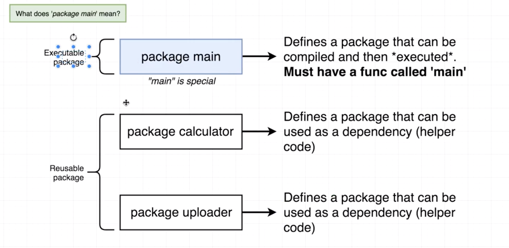

### Import Statements

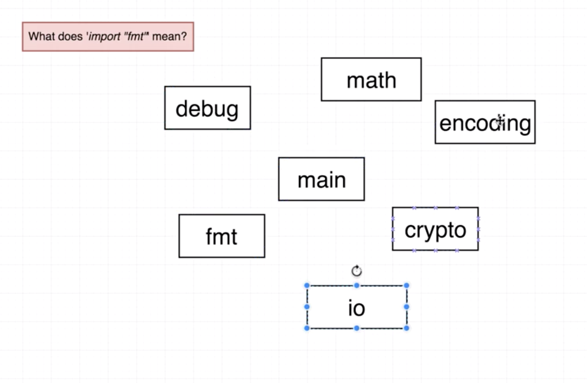

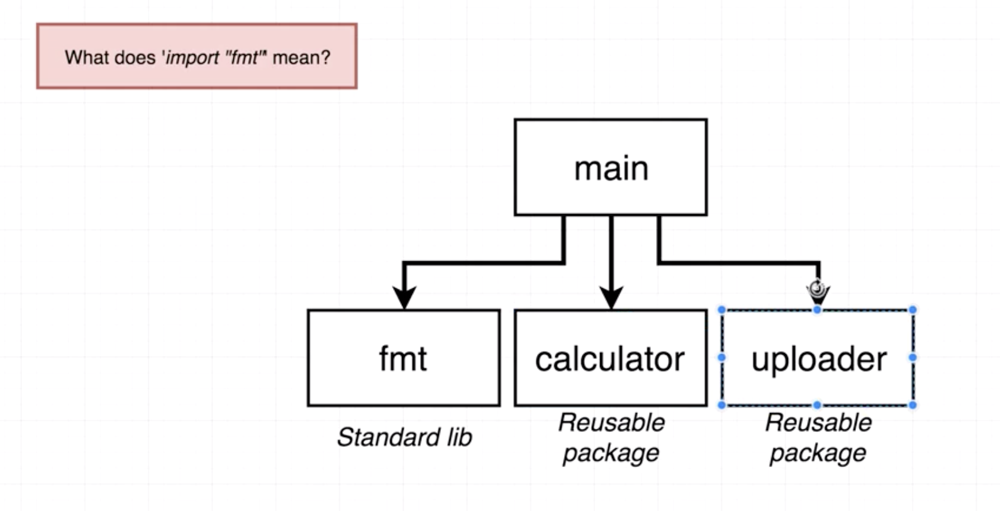

<https://golang.org/pkg/>

### File Orgnizatoin

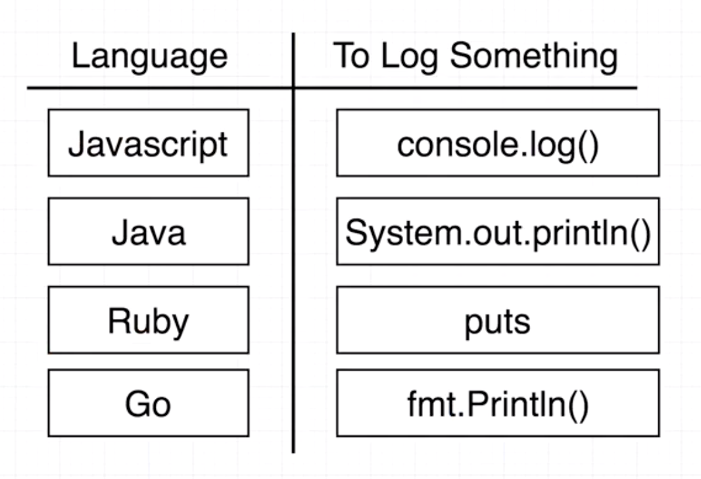

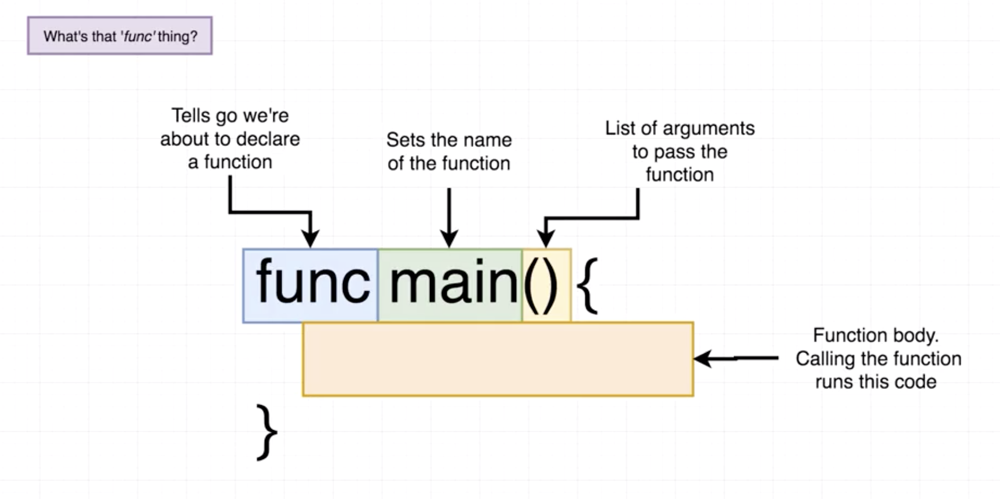

**How is the main.go file organized?**

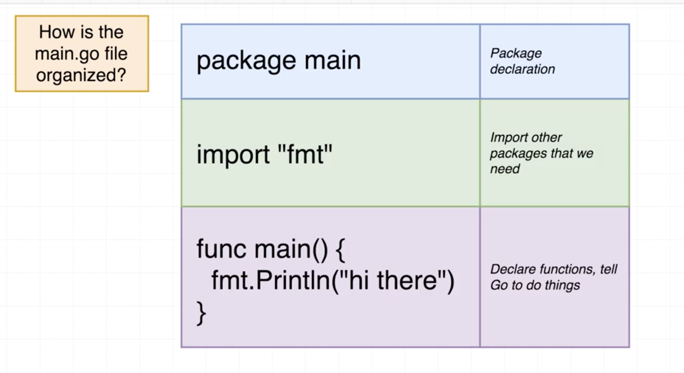


###


