### Project Overview

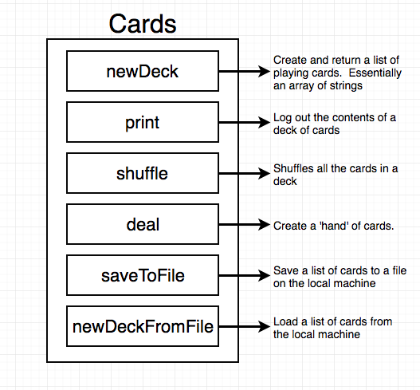

### New Project Folder

src/cards

### Variable Declarations

src/cards/main.go

```go
func main() {
	var card = "Ace of Spades"
	fmt.Println(card)
}
```

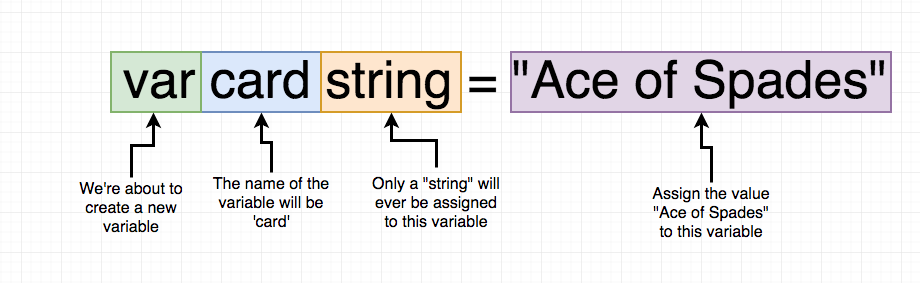

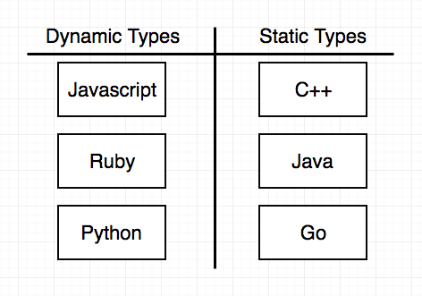

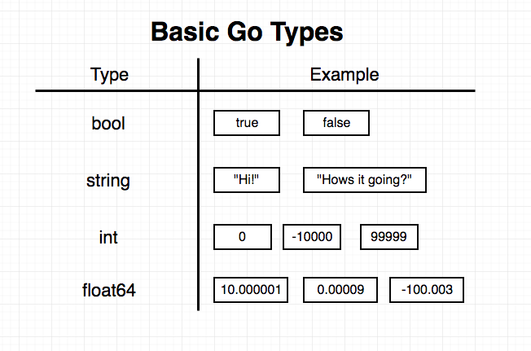


```go
func main() {
	// var card = "Ace of Spades"
	card := "Ace of Spades"
	fmt.Println(card)
}
```

### Functions and Return Types

```go
func main() {
	card := newCard()
	fmt.Println(card)
}
```

```go
func newCard() string {
	return "Five of Diamonds"
}
```

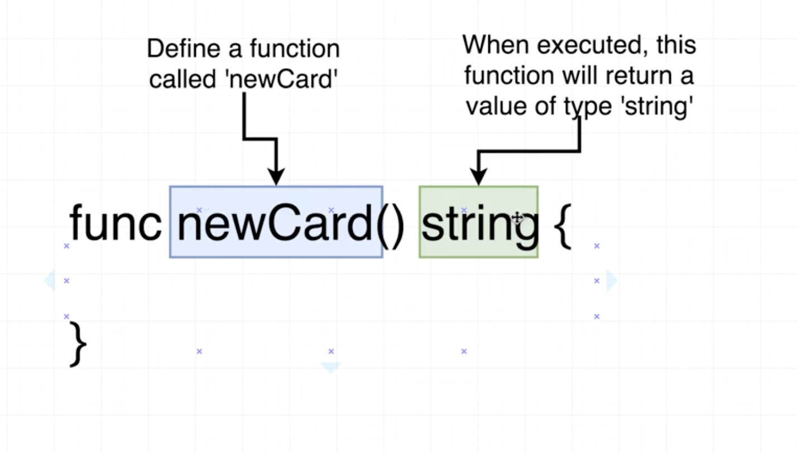

### Slices and For Loops

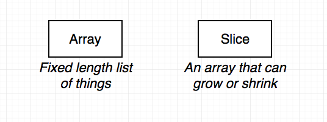

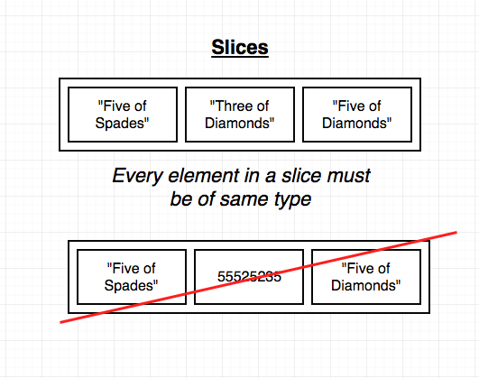

**Slice example and Add new Item**

```go
func main() {
	cards := []string{"Ace of Diamonds", newCard()}
	// Add new item
	cards = append(cards, "Six of Spades")
	fmt.Println(cards)
}
```

**Iterate slice**

```go
func main() {
	cards := []string{"Ace of Diamonds", newCard(), "Six of Spades"}

	// Iterate slice
	for i, card := range cards {
		fmt.Println(i, card)
	}
}
```

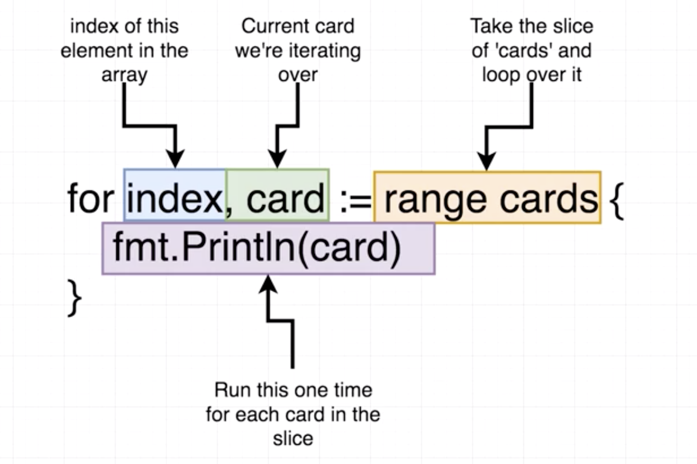

### OO Approach vs Go Approach

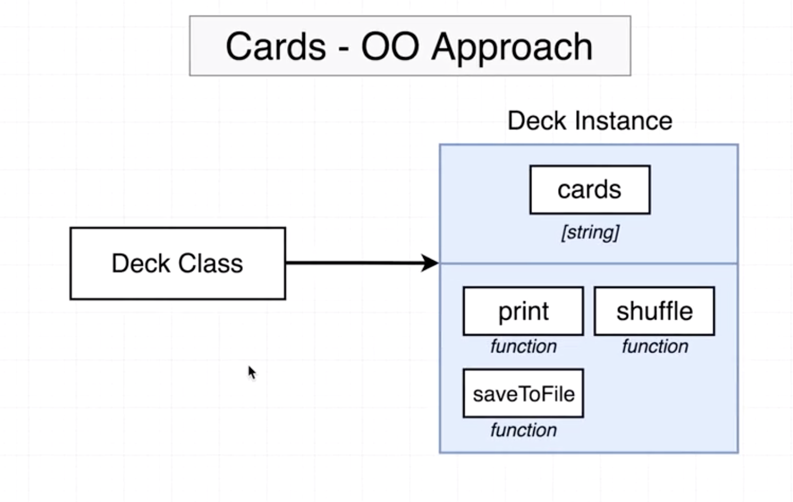

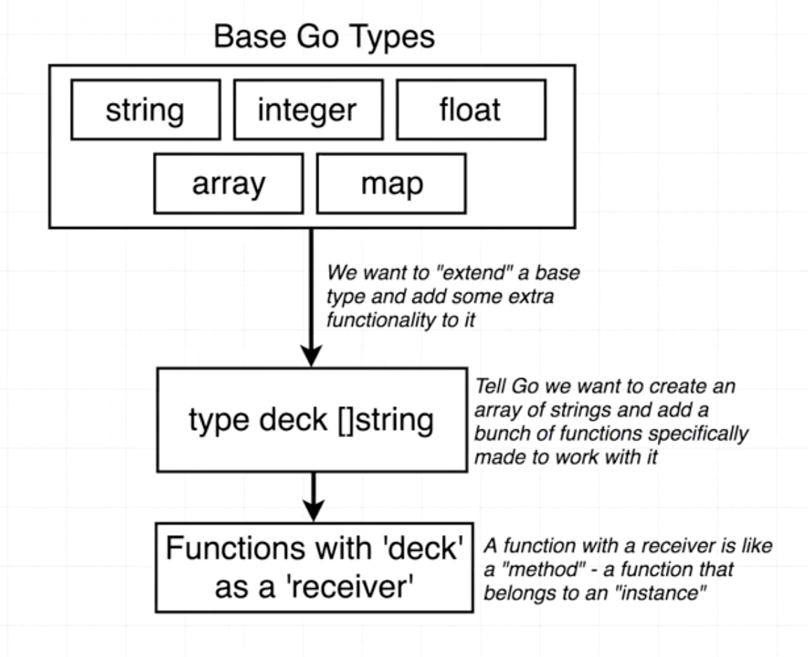

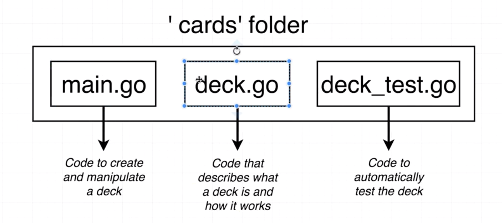


### Custom Type Declarations

/src/cards/deck.go

```go
package main

import "fmt"

// Create a new type of 'deck'
// which is a slice of strings
type deck []string

func (d deck) print() {
	for index, card := range d {
		fmt.Println(index, card)
	}
}

```

/src/cards/main.go

```go
package main

func main() {
    cards := deck{"Ace of Diamonds", newCard()}
    cards = append(cards, "Six of Spades")

    cards.print()
}

func newCard() string {
    return "Five of Diamonds"
}
```

```sh
$ go run main.go deck.go
```

### Receiver Functions

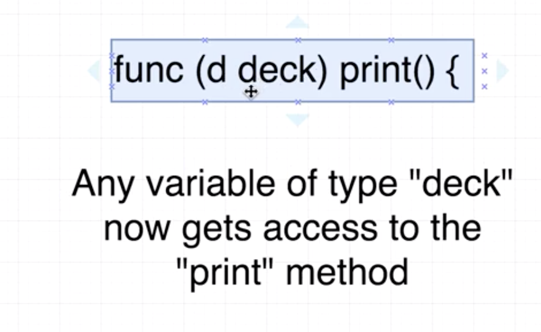

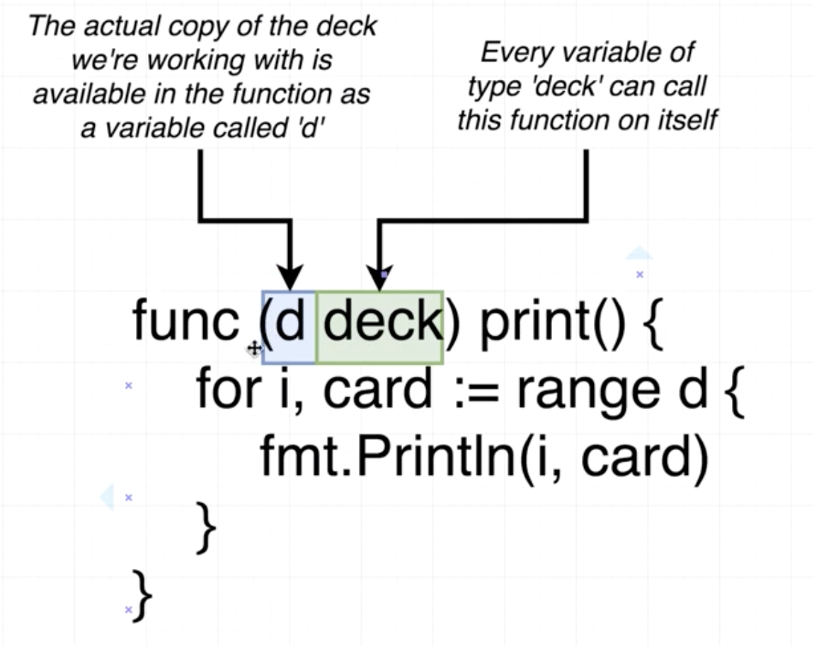

### Creating a New Deck

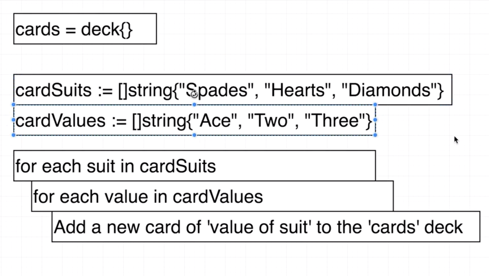

/src/cards/deck.go

```go
// Create a new type of 'deck'
// which is a slice of strings
type deck []string

func newDeck() deck {
	cards := deck{}

	cardSuits := []string{"Spades", "Diamonds", "Hearts", "Clubs"}
	cardValues := []string{"Ace", "Two", "Three", "Four"}

	for _, suit := range cardSuits {
		for _, value := range cardValues {
			cards = append(cards, suit+" of "+value)
		}
	}

	return cards

}

func (d deck) print() {
	for index, card := range d {
		fmt.Println(index, card)
	}
}
```

/src/cards/main.go

```go
func main() {
    cards := newDeck()
    cards.print()
}
```

### Slice Range Syntax

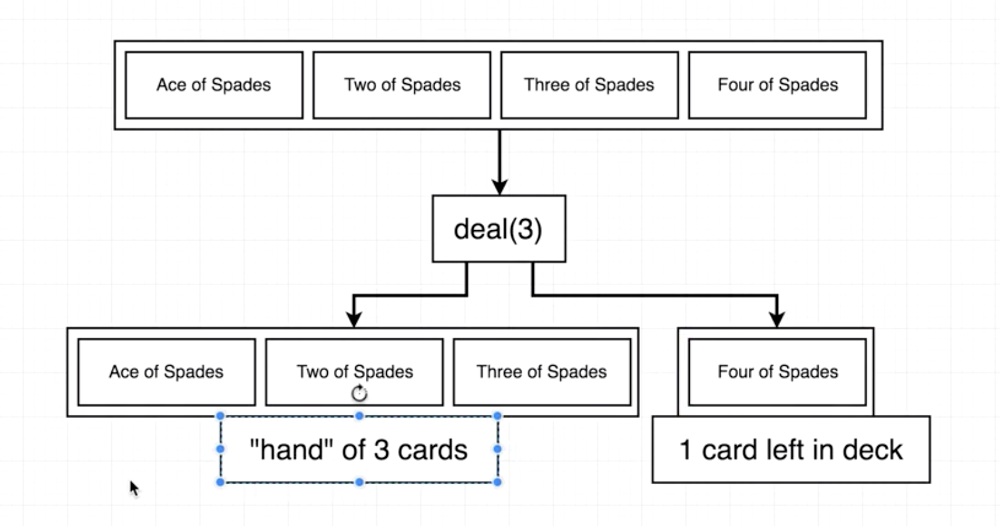

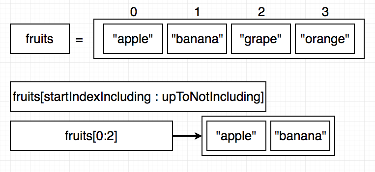

### Multipole Return Values

/src/cards/deck.go

```go
func deal(d deck, handSize int) (deck, deck) {
	return d[:handSize], d[handSize:]
}
```

/src/cards/main.go

```go
func main() {
	cards := newDeck() 
	hand, remainingDeck := deal(cards, 5)

	hand.print()
	remainingDeck.print()
}
```

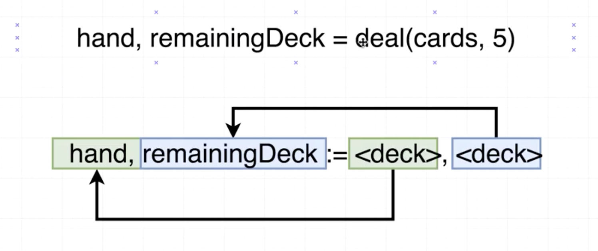

### Byte Slices

<https://golang.org/pkg/io/ioutil/>

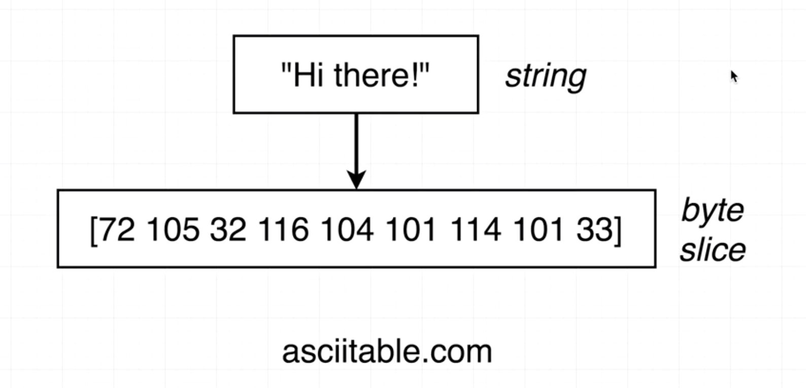


### Deck to String

**Type Conversion**

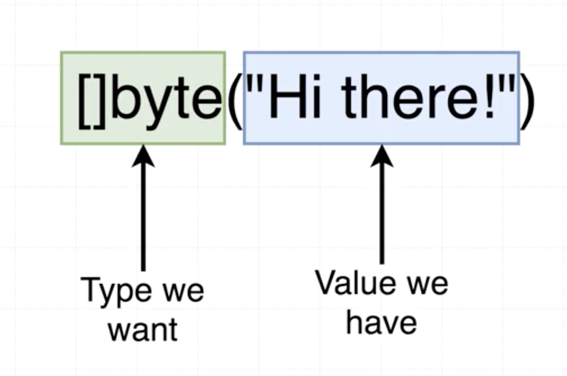

/src/cards/main.go

```go
func main() {
	greeting := "Hi there! "
	fmt.Println([]byte(greeting))
}
```

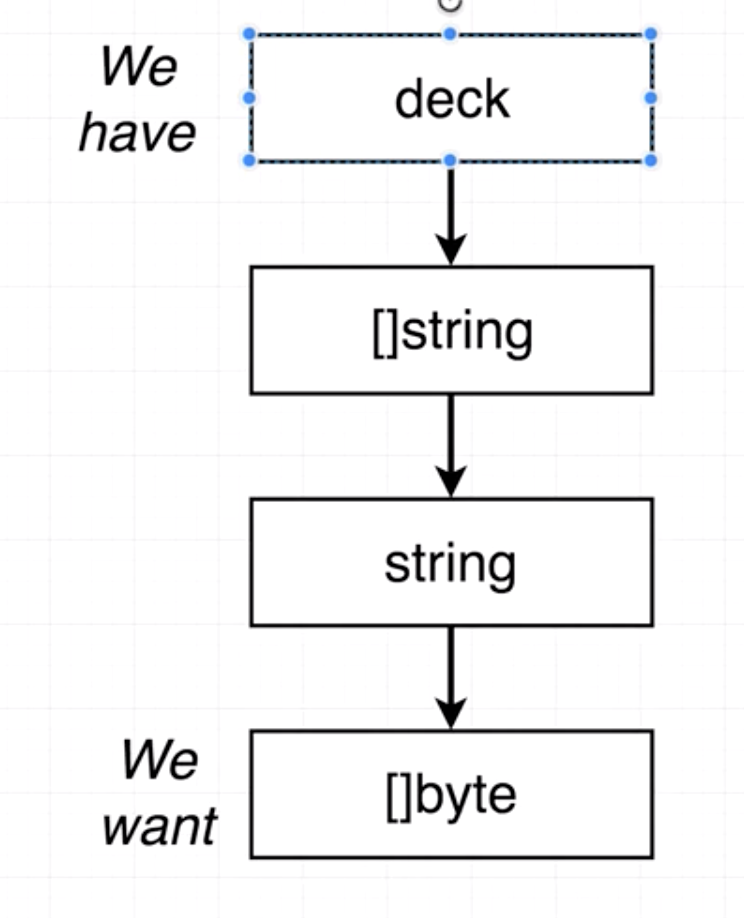


### Joining a Slice of Strings

/src/cards/deck.go

```go
func (d deck) toString() string {
	return strings.Join([]string(d), ",")
}
```

[https://golang.org/pkg/strings/\#Join](https://golang.org/pkg/strings/#Join)

/src/cards/main.go

```go
func main() {
	cards := newDeck()
	fmt.Println(cards.toString())
}
```

### Saving Data to the Hard Drive

/src/cards/deck.go

```go
func (d deck) saveToFile(filename string) error {
	return ioutil.WriteFile(filename, []byte(d.toString()), 0666)
}
```

/src/cards/main.go

```go
func main() {
	cards := newDeck()
	cards.saveToFile("my_cards")
}
```

### Reading From the Hard Drive

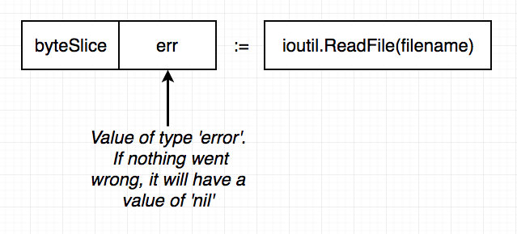

[https://golang.org/pkg/io/ioutil/\#ReadFile](https://golang.org/pkg/io/ioutil/#ReadFile)

/src/cards/deck.go

```go
func newDeckFromFile(filename string) deck {
	byteSlice, err := ioutil.ReadFile(filename)
	if err != nil {
		// Option #1 - log the error and return a call to newDeck()
		// Option #2 -log the error and entirely quit the program
		fmt.Println("Error: ", err)
		os.Exit(1)
	}

	stringSlice := strings.Split(string(byteSlice), ",") // Ace of Spades,Two of Spades,Three of Spades,...
	return deck(stringSlice)
}
```

/src/cards/main.go

```go
func main() {
	cards := newDeckFromFile("my_cards")
	cards.print()
}
```

/src/cards/main.go (error)

```go
func main() {
	cards := newDeckFromFile("my")
	cards.print()
}
```

### Shuffling a Deck

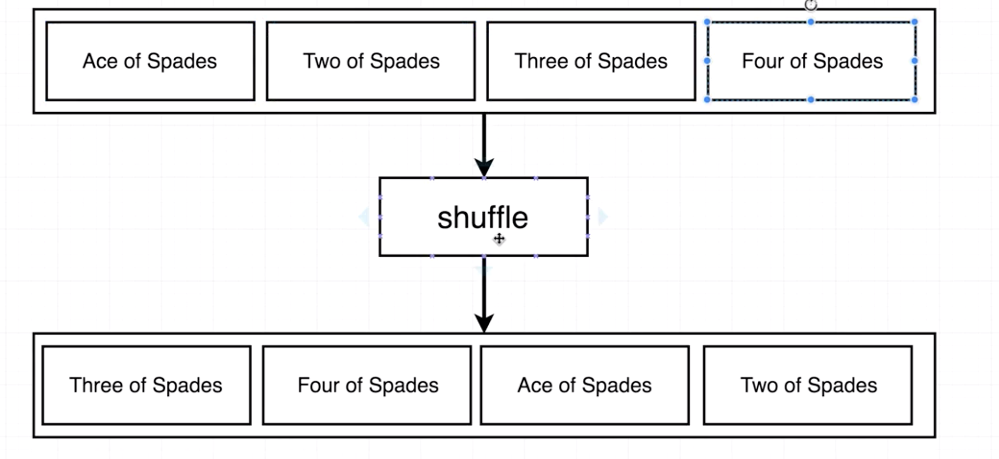

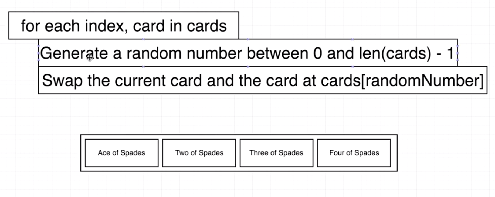

[https://golang.org/pkg/math/rand/\#Intn](https://golang.org/pkg/math/rand/#Intn)

/src/cards/deck.go

```go
func (d deck) shuffle() {
	for index := range d {
		newPosition := rand.Intn(len(d) - 1)
		// swap item in index and in newPosition
		d[index], d[newPosition] = d[newPosition], d[index]

	}
}
```

/src/cards/main.go

```go
func main() {
    cards := newDeck()
    cards.shuffle()
    cards.print()
}
```

### Random Number Generation

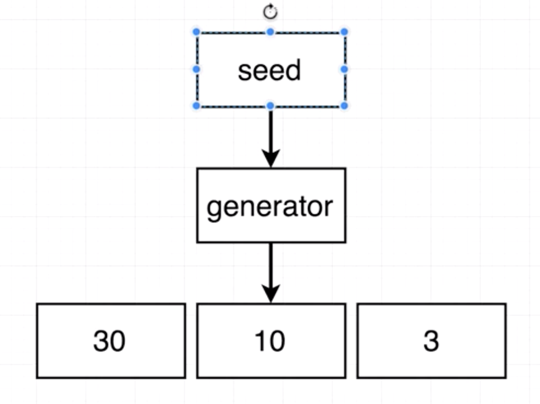

[https://golang.org/pkg/math/rand/\#Rand](https://golang.org/pkg/math/rand/#Rand)

Better Approach to generate random number to change numbers every time

/src/cards/deck.go

```go
func (d deck) shuffle() {
	source := rand.NewSource(time.Now().UnixNano())
	r := rand.New(source)

	for i := range d {
		newPosition := r.Intn(len(d) - 1)
		d[i], d[newPosition] = d[newPosition], d[i]
	}
}
```

### Testing With Go

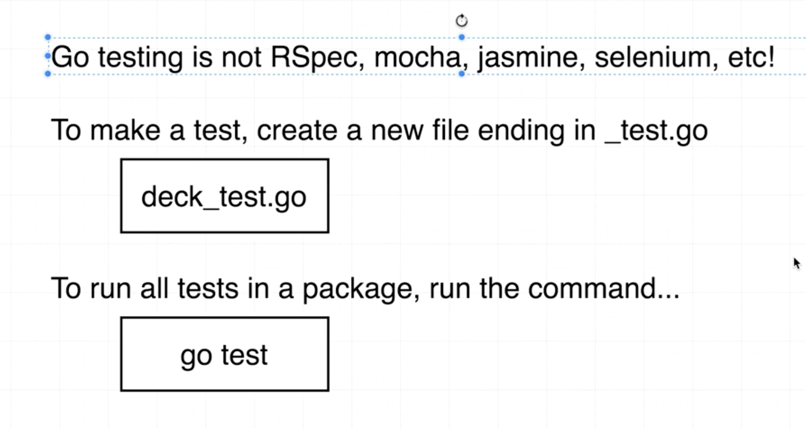

### Writing Useful Tests

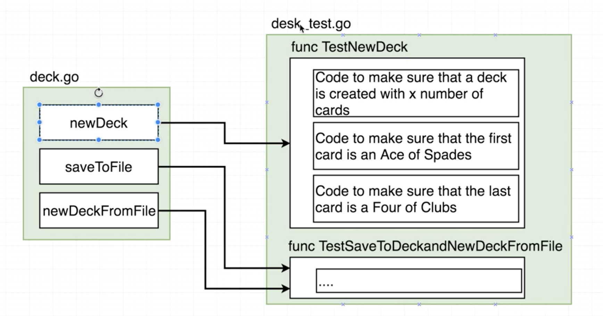

To make a test, create a new file ending in \_test.go

/src/cards/deck\_test.go

```go
func TestNewDeck(t *testing.T) {
	d := newDeck()

	if len(d) != 16 {
		t.Errorf("Expected deck length of 16, but got %v", len(d))
	}

	if d[0] != "Ace of Spades" {
		t.Errorf("Expected first card of Ace of Spades, but got %v", d[0])
	}

	if d[len(d)-1] != "Four of Cubes" {
		t.Errorf("Expected last card of Four of Cubes, but got %v", d[len(d)-1])
	}
}
```

### Testing File IO

```go
func TestSaveToDeckAndNewDeckFromFile(t *testing.T) {
	os.Remove("_decktesting")

	deck := newDeck()
	deck.saveToFile("_decktesting")

	loadedDeck := newDeckFromFile("_decktesting")

	if len(loadedDeck) != 16 {
		t.Errorf("Expected 16 cards in deck, got %v", len(loadedDeck))
	}

	os.Remove("_decktesting")
}
```

### Assignment 1: Even and Odd

```go
func main() {
	numbers := []int{0, 1, 2, 3, 4, 5, 6, 7, 8, 9, 10}

	for number := range numbers {
		if number%2 == 0 {
			fmt.Println(number, " is even")
		} else {
			fmt.Println(number, " is odd")
		}
	}
}
```


