### Structs in Go

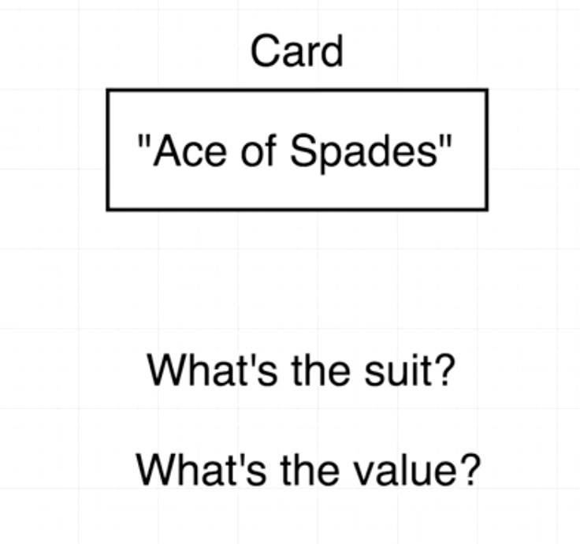


**Struct**

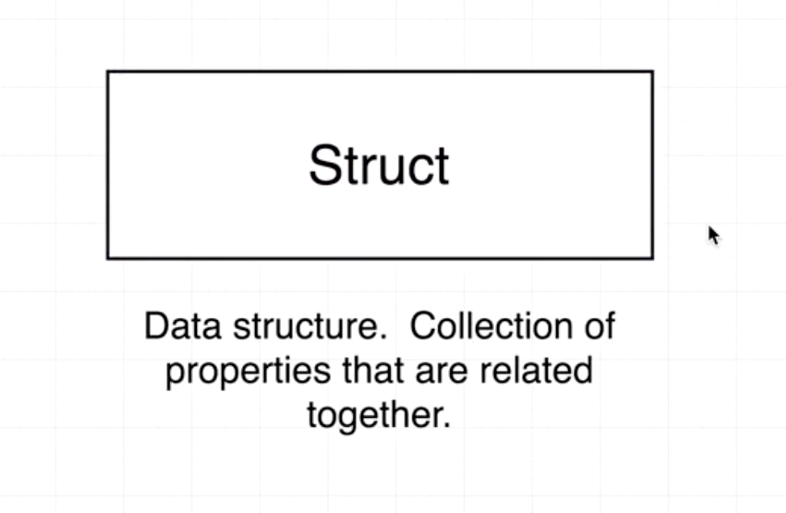

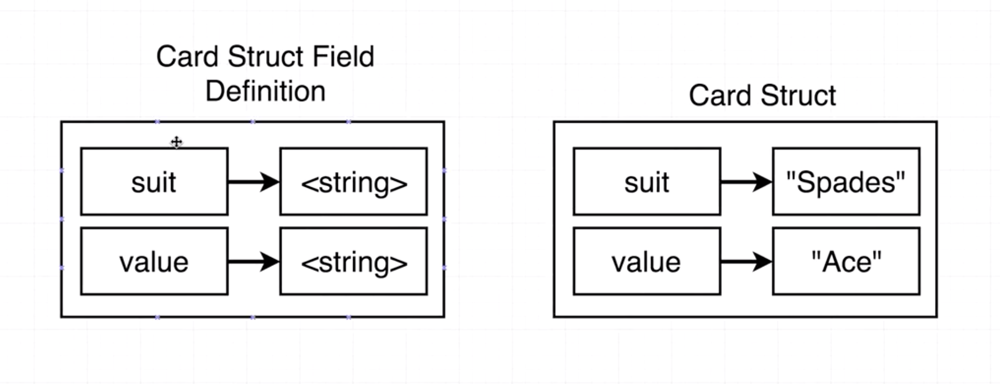

### Defining Structs

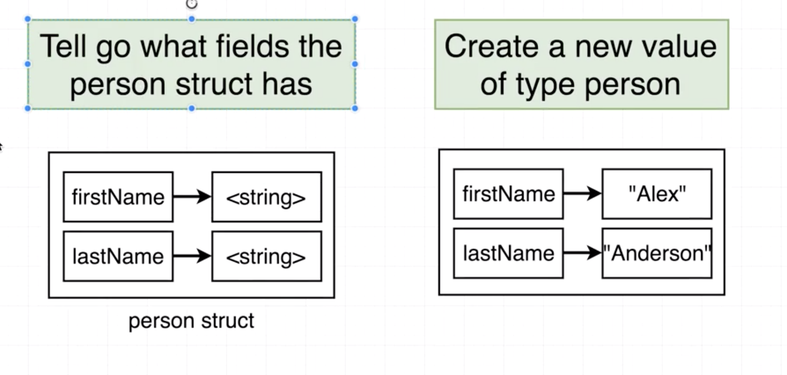

/src/struct/main.go

```go
type person struct {
	firstName string
	lastName  string
}
```

### Declaring Structs

/src/struct/main.go

```go
func main() {
	alex := person{firstName: "Alex", lastName: "Anderson"}
	fmt.Println(alex)
}
```

### Updating Struct Values

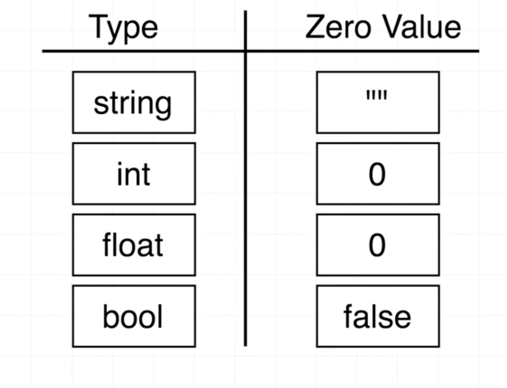

/src/struct/main.go

```go
func main() {
	var alex person

	alex.firstName = "Alex"
	alex.lastName = "Anderson"

	fmt.Println(alex)
	fmt.Printf("%+v", alex)
}
```

### Embedding Structs

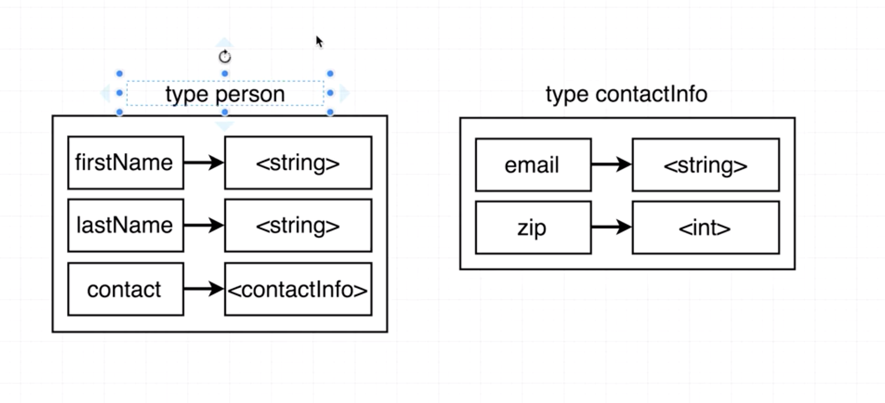

/src/struct/main.go

```go
type contactInfo struct {
	email   string
	zipCode int
}

type person struct {
	firstName string
	lastName  string
	contact   contactInfo
}

func main() {
	mer := person{
		firstName: "Mer",
		lastName:  "JQ",
		contact: contactInfo{
			email:   "mer@gmail.com",
			zipCode: 94000,
		},
	}

	fmt.Println(mer)
}
```

### Structs with Receiver Functions

src/struct/main.go

```go
type contactInfo struct {
	email   string
	zipCode int
}

type person struct {
	firstName string
	lastName  string
	contactInfo
}

func main() {
	jim := person{
		firstName: "Jim",
		lastName:  "Party",
		contactInfo: contactInfo{
			email:   "jim@gmail.com",
			zipCode: 94000,
		},
	}

	fmt.Println(jim)
}
```

**Add receiver functions**

/src/struct/main.go

```go
func main() {
  mer.updateName("Jieqiong")
  mer.print()
}

func (p person) print() {
    fmt.Println(p)
}

func (p person) updateName(newFirstName string) {
	p.firstName = newFirstName
}
```

### Pass By Value

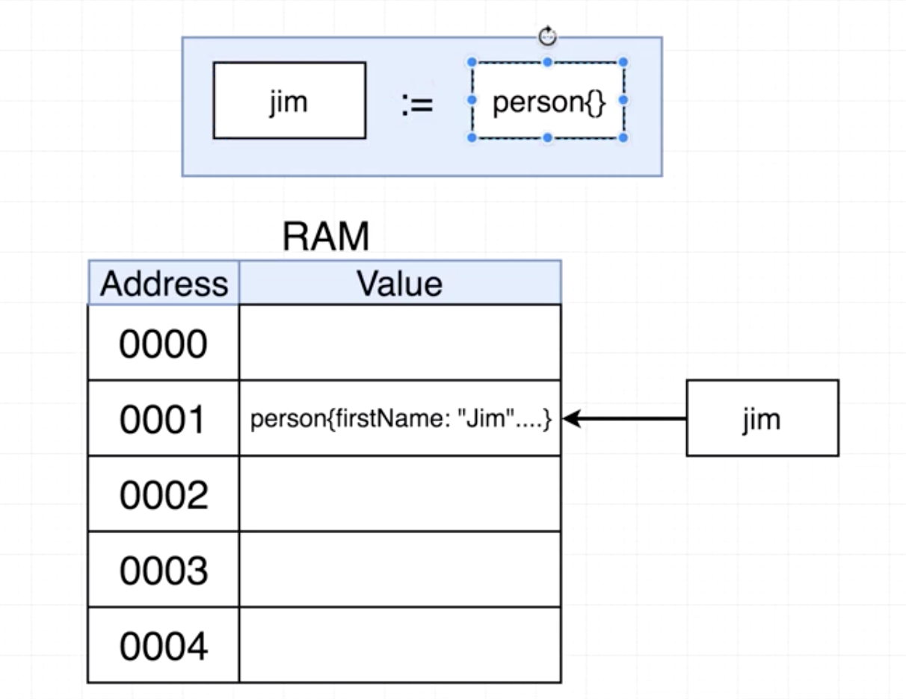

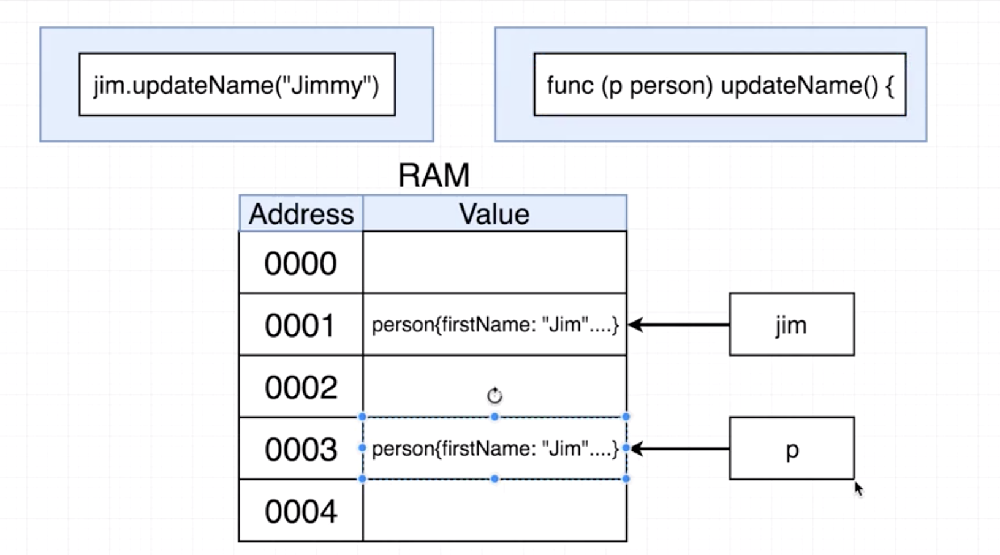

### Structs with Pointers

/src/struct/main.go

```go
func main() {
  merPointer := &mer
	merPointer.updateName("Jieqiong")
	mer.print()
}

func (p *person) updateName(newFirstName string) {
	(*p).firstName = newFirstName
}
```

### Pointer Operations

**&variable**

Give me the memory address of the value this variable is pointing at

**\*pointer**

Give me the value this memory address is pointing at

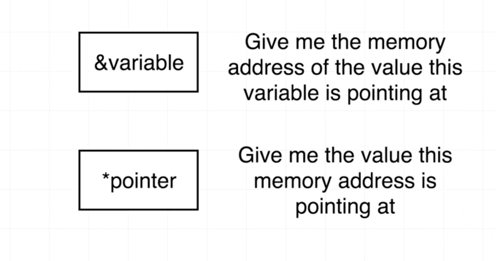

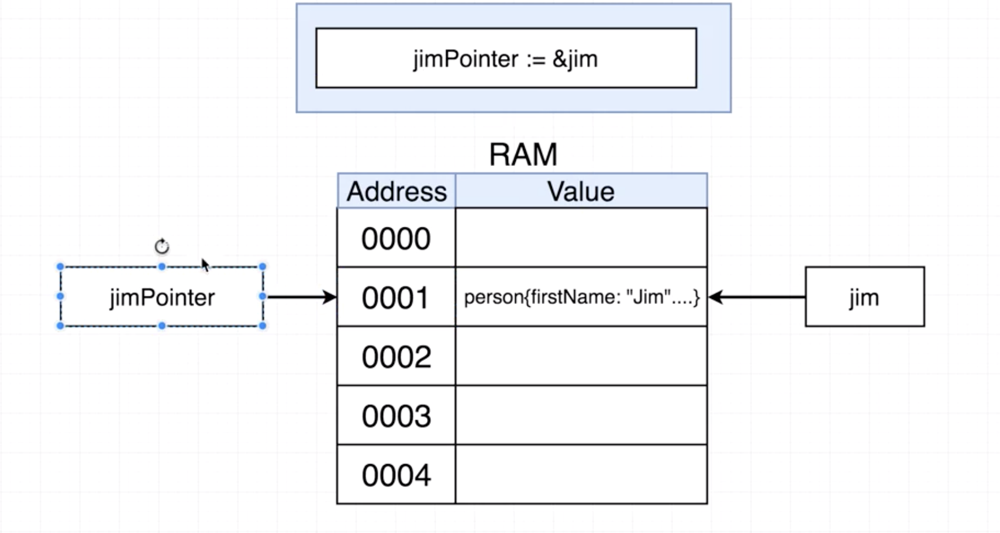

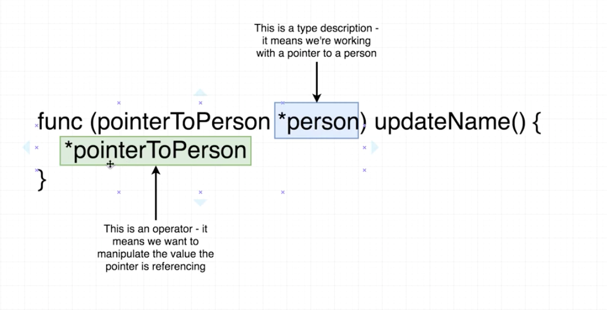

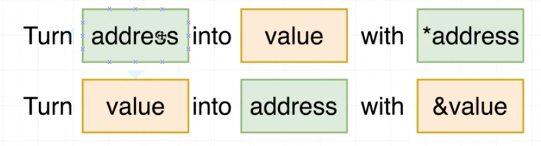

### Pointer Shortcut

main.go

```go
func main() {
	mer.updateName("Jieqiong")
	mer.print()
}

func (pointerToPerson *person) updateName(newFirstName string) {
	(*pointerToPerson).firstName = newFirstName
}
```

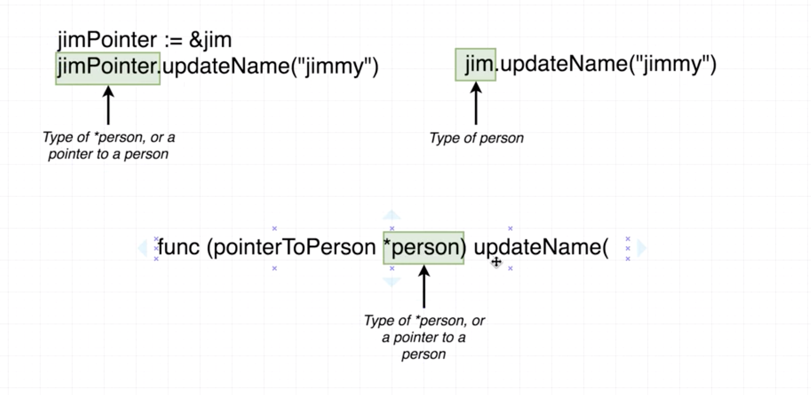

### **Gotchas With Pointers**

/src/struct/main.go

```go
func main() {
    mySlice := []string{"Hi", "There", "How", "Are", "You"}
    updateSlice(mySlice)
    fmt.Println(mySlice)
}

func updateSlice(s []string) {
    s[0] = "Bye"
}
```

### Reference vs Value Types

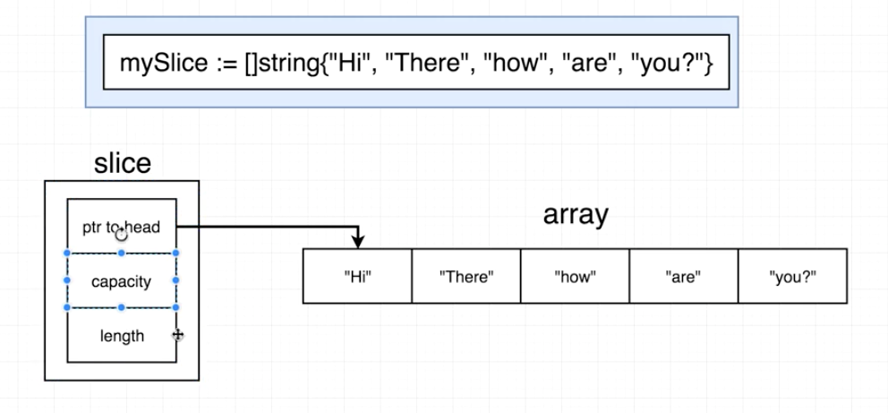

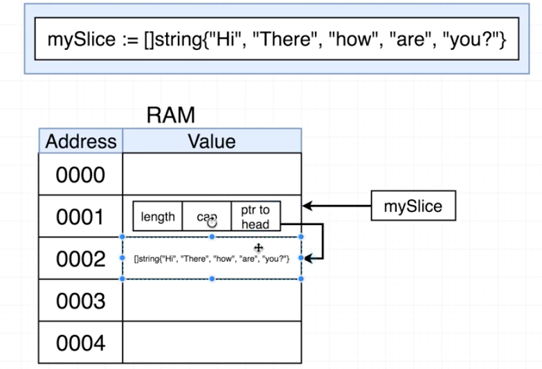

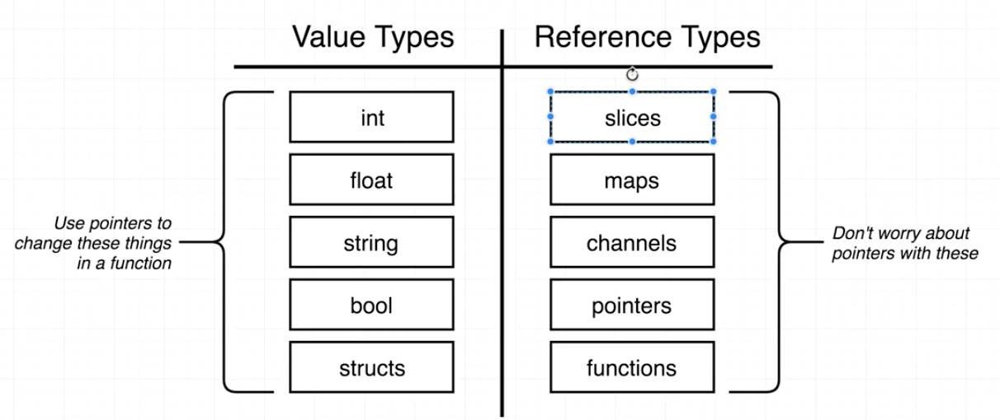


