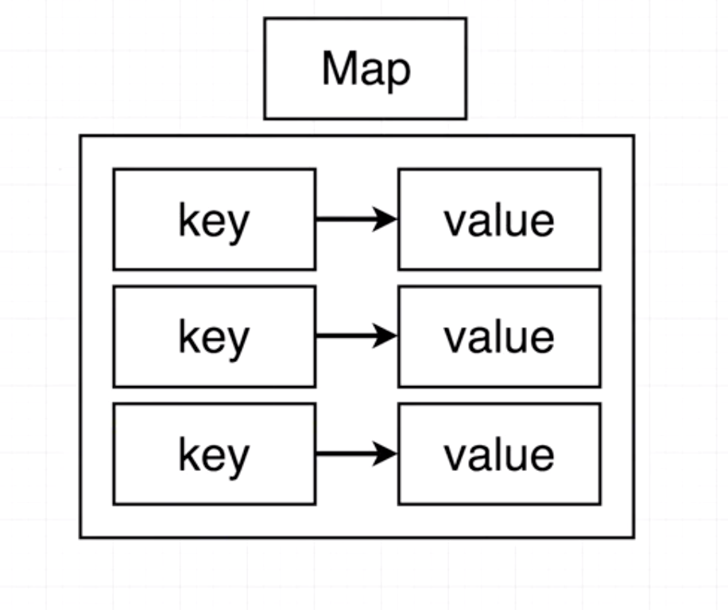
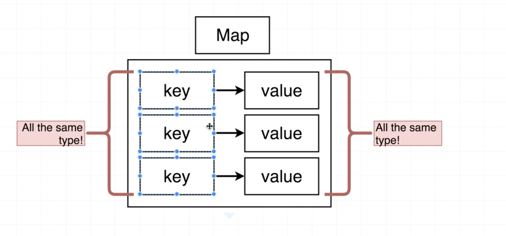
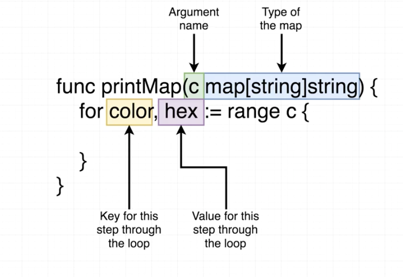
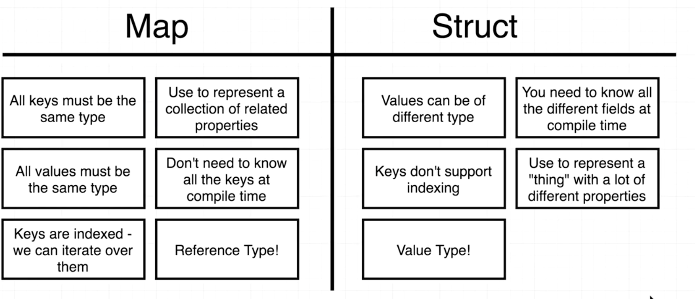

### What’s a Map?





/src/map/main.go

```go
func main() {
	colors := map[string]string{
		"red":   "#ff0000",
		"green": "#4bf745",
	}
	fmt.Println(colors)
}
```

### Manipulating Maps

Another methods to create a map

```go
var colors map[string]string
```

```go
colors := make(map[string]string)
```

Assign value to the map

```go
colors["white"] = "#ffffff"
```

To delete key in map

```go
delete(colors, "white")
```

### Iterating Over Maps



main.go

```go
func main() {
	colors := map[string]string{
		"red":   "#ff0000",
		"green": "#rbf745",
		"white": "#ffffff",
	}

	printMap(colors)
}

func printMap(c map[string]string) {
	for color, hex := range c {
		fmt.Println("Hex code for", color, "is", hex)
	}
}
```

### Diffrerences Between Maps and Structs




