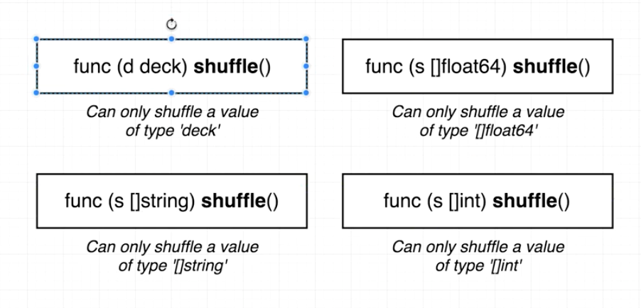
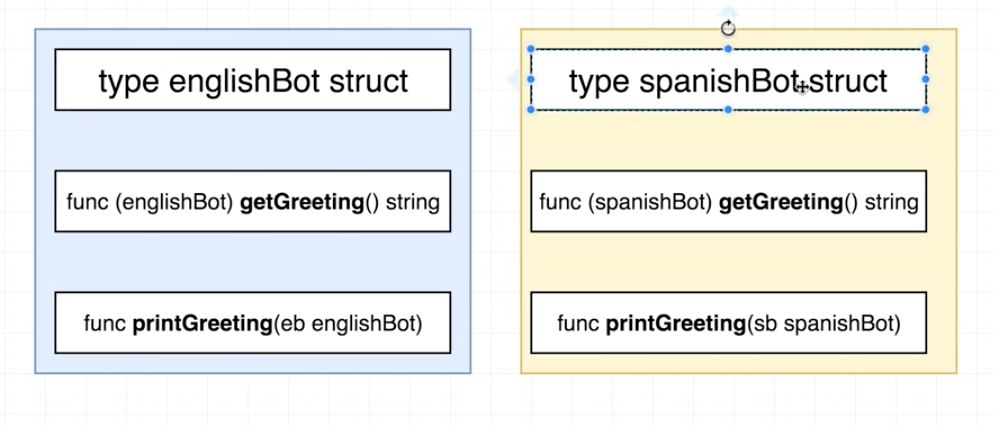
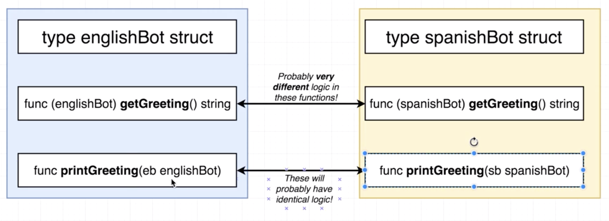
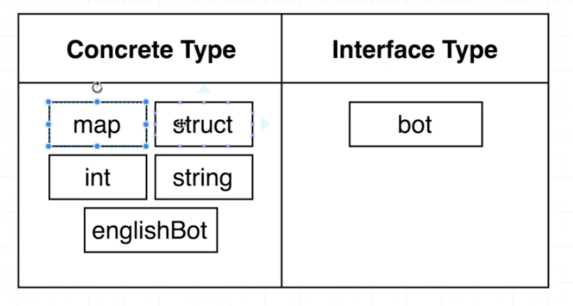
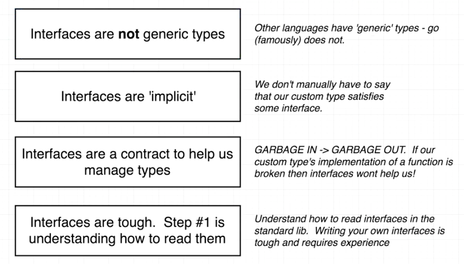
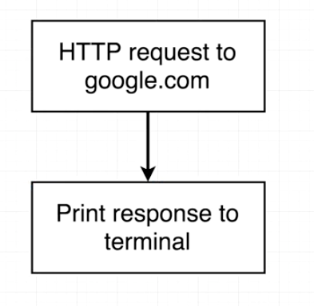
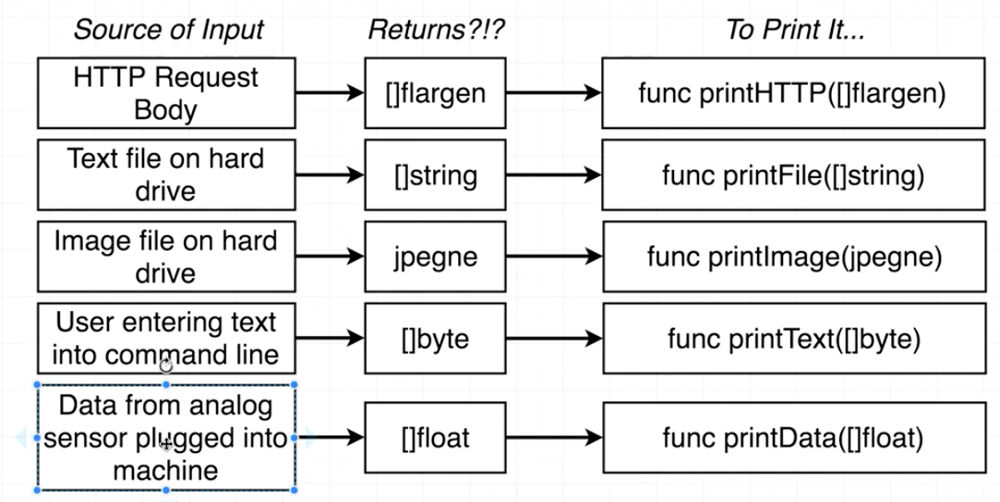
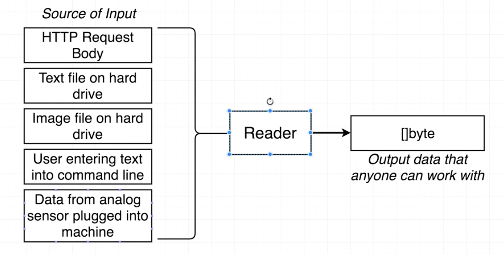
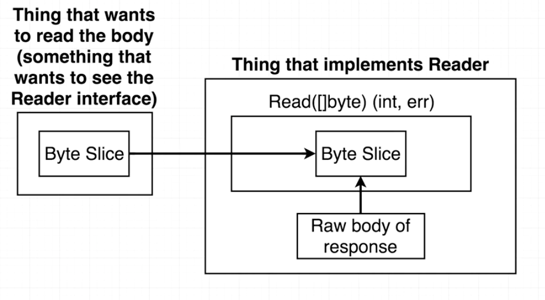

### Purpose of Interfaces







### Interfaces in Practice

main.go

```go
type bot interface {
	getGreeting() string
}

type englishBot struct{}
type spanishBot struct{}

func main() {
	eb := englishBot{}
	sb := spanishBot{}

	printGreeting(eb)
	printGreeting(sb)

}

func printGreeting(b bot) {
	fmt.Println(b.getGreeting())
}

func (englishBot) getGreeting() string {
	// VERY custom logic for generating an english greeting
	return "Hi There!"
}

func (spanishBot) getGreeting() string {
	// VERY custom logic for generating an spanish greeting
	return "Hola!"
}
```

### Rules of Interfaces



### Extra Interface Notes



### The HTTP Package



### The Reader Interface





### More on the Reader Interface



### Working with the Read Function

main.go

```go
package main

import (
	"fmt"
	"net/http"
	"os"
)

func main() {
	resp, err := http.Get("https://www.google.com/")
	if err != nil {
		fmt.Println("Error: ", err)
		os.Exit(1)
	}

	bs := make([]byte, 99999)
	resp.Body.Read(bs)
	fmt.Println(string(bs))
}
```

### The Writer Interface

main.go

```go
package main

import (
	"fmt"
	"io"
	"net/http"
	"os"
)

func main() {
	resp, err := http.Get("https://www.google.com/")
	if err != nil {
		fmt.Println("Error: ", err)
		os.Exit(1)
	}

	io.Copy(os.Stdout, resp.Body)
}
```

### A Custom Writer

main.go

```go
package main

import (
	"fmt"
	"io"
	"net/http"
	"os"
)

type logWriter struct{}

func main() {
	resp, err := http.Get("https://www.google.com/")
	if err != nil {
		fmt.Println("Error: ", err)
		os.Exit(1)
	}

	lw := logWriter{}

	io.Copy(lw, resp.Body)
}

func (logWriter) Write(bs []byte) (int, error) {
	fmt.Println(string(bs))
	fmt.Println("Just wrote this many bytes:", len(bs))
	return len(bs), nil
}
```


